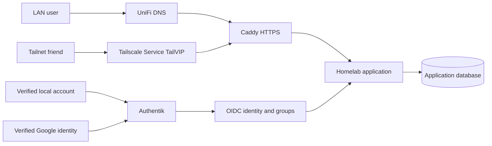

# Authentication And Identity

Authentik at `auth.home.feocco.com` is the homelab identity provider. It gives
applications one login experience through verified local accounts or Google,
while each application remains responsible for its own sessions and data
authorization.

This page is the high-level architecture. The accepted decisions live in
[ADR 0001](adr/0001-unified-homelab-identity.md), and day-to-day Authentik
operations live in the
[Authentik runbook](https://github.com/feocco/homelab-config/blob/main/services/authentik/README.md).

## Architecture

The controls are deliberately independent:

- Tailscale or the LAN determines whether a client can establish a network
  connection.
- Caddy terminates HTTPS and selects the application from TLS SNI.
- Authentik proves the application user's identity with OIDC.
- Authentik groups grant coarse member or administrator access.
- The application owns its session, protected routes, and row-level data
  authorization.

Network access never substitutes for application authentication, and an OIDC
login never grants network access that Tailscale policy denied.

## Reachability Classes

There is one accepted pattern for each exposure intent:

- **Owner-private:** a normal `*.home.feocco.com` route uses UniFi DNS on the
  LAN and the Mac mini's Tailnet address off-LAN. This is for Joe's existing
  private access.
- **Friend-private:** a named Tailscale Service gives the application its own
  TailVIP and carries raw TCP 443 to Caddy. This is the only accepted pattern
  for sharing a private Caddy application with friends; do not grant a node or
  expose the application's direct port.
- **Intentionally public:** Cloudflare Tunnel/Access supplies the off-LAN path
  while UniFi DNS keeps LAN traffic local. This is a separate public-internet
  decision, not an alternative friend-sharing path.

For a friend-private route, public Cloudflare DNS-only records point to the
service TailVIP, while UniFi DNS points the same hostname to the Mac mini LAN
address. Raw TCP forwarding preserves TLS SNI so the existing Caddy virtual
host remains the only HTTP entrypoint.

## Application Identity Contract

Applications adopting the shared identity platform follow these rules:

- Use OIDC authorization code with PKCE, state, and nonce.
- Key a person by immutable `(issuer, subject)`, never by email or username.
- Refresh username, display name, email, and group snapshots at login.
- Use Authentik groups only for coarse application and administrator access.
- Use an application-owned user id for row ownership and durable user state.
- Keep protected media and APIs behind the same application session as pages.
- Ignore proxy-supplied user headers.
- Link the signed-in account menu to Authentik's central profile editor.
- Revoke the local session and continue through Authentik's end-session flow on
  logout.

The implementation remains repo-local until a second application proves which
code, if any, should become a shared package. The contract is reusable now; a
shared framework is not required.

## Accounts And Linking

Local accounts choose a username and password and remain inactive until email
verification succeeds. Google login may link to an existing account only when
Google supplies a verified email and Authentik's `email_link` policy matches
that address. Username and email are profile attributes, not authorization
keys.

The central self-service profile is
`https://auth.home.feocco.com/if/user/#/settings`. Optional TOTP and passkeys
are user-managed; MFA is not mandatory in the current policy.

## Adopting Another Application

1. Define `<app>-users` and, when needed, `<app>-admins` groups.
2. Add a source-controlled Authentik provider/application blueprint with the
   exact callback URL and `openid profile email groups` scopes.
3. Implement the application identity contract and a small account menu that
   links to central profile settings and performs complete logout.
4. Store OIDC secrets through the homelab secret workflow and keep the app's
   durable user/session state in its own database.
5. Choose the reachability class deliberately. Use a named Tailscale Service
   for friend access and retain Caddy as the only HTTP entrypoint.
6. Test two-user row isolation, member/admin denial, session/logout behavior,
   protected raw assets, DNS/SNI routing, and negative access to an unrelated
   service before rollout.

Use the `homelab-authentik-app-integration` skill for the executable cross-repo
workflow.

## Sources Of Truth

- Architecture decision: `docs/adr/0001-unified-homelab-identity.md`
- Authentik runtime and operations: `services/authentik/`
- Route intent: service `ops.yaml` plus `hosts/macmini/tailscale-serve.yaml`
- Friend policy template: `docs/tailscale-friends-policy.hujson`
- Application behavior: the application's source repo and security docs

Provider consoles and live Authentik data are runtime state. Reconcile durable
configuration into git-backed blueprints, manifests, scripts, and secret-name
contracts.
